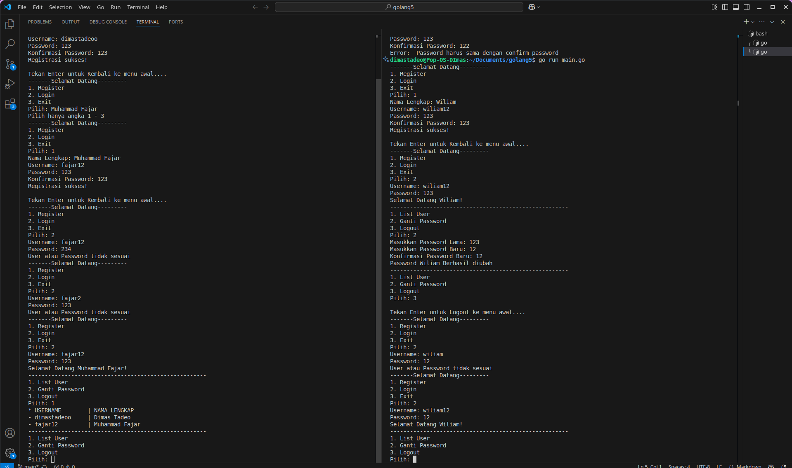

# Program interaktif authentikasi flow menggunakan golang

## Berikut merupakan preview program authentikasi flow sederhana dengan golang

### Screenshoot Program 

Untuk alur program, ketika program dijalankan, akan ada 3 menu utama, Register, Login, dan Exit. jika memilih nomor diluar opsi, maka akan menampilkan pesan untuk memilih sesuai opsi dan kembali ke menu sebelumnya.
berikut merupakan jika memilih sesuai opsi menu.
- opsi register ketika memilih menu register maka akan diarahkan untuk buat user baru, untuk mengisi nama lengkap, username, dan password.
jika input sudah sesuai maka akan kembali ke menu awal, tapi jika tidak sesuai maka akan memunculkan pesan panic dan program akan diakhirir
- opsi login ketika memilih menu login maka akan diarahkan untuk mengisi user dan password, jika data tidak sesuai akan memunculkan pesan error dan prorgram akan kembali ke menu awal. jika sudah maka akan diarahkan ke menu tampilan user, dimana disini ada 3 opsi yang dipilih. List User, Rubah Password, dan Logout
- List user dipakai untuk melihat data nama lengkap dan username yang tersimpan
- rubah password, untuk mengganti password dengan autentikasi password lama
- logout untuk keluar dari tampilan user an kembali ke menu awal
- lalu di menu awal ada menu exit yang dipakai untuk mengakhiri program

Program ini sudah menggunakan workflow build app otomatis dalam bentuk aplikasi Linux, Windows, dan Mac, yang ada dibagian release. dan program ini sudah build images otomatis dengan server docker alpine, yang bisa di pull di bagian package